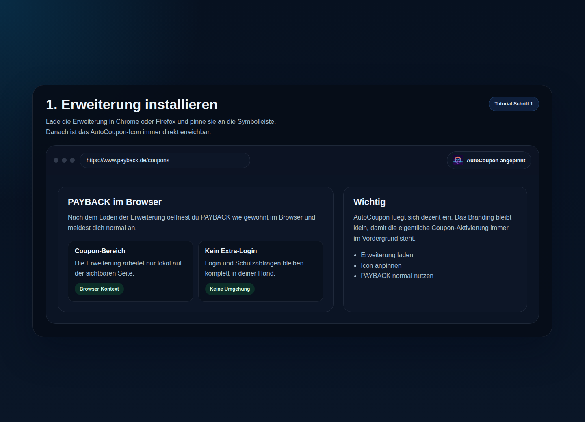
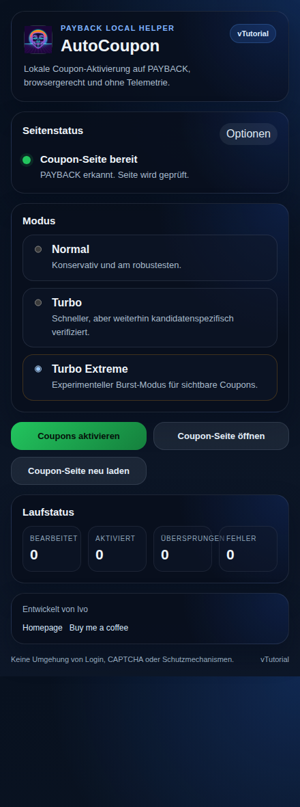
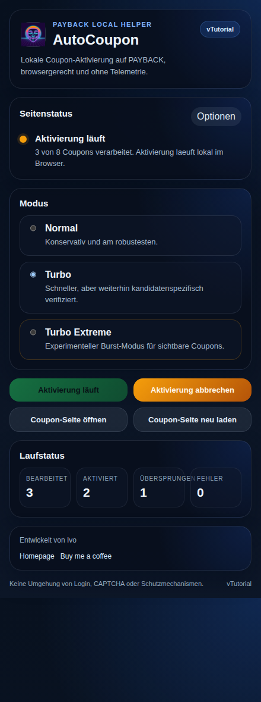
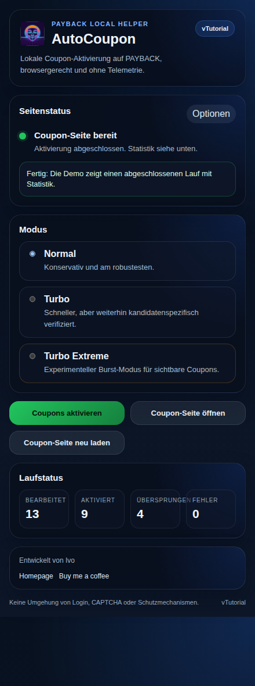
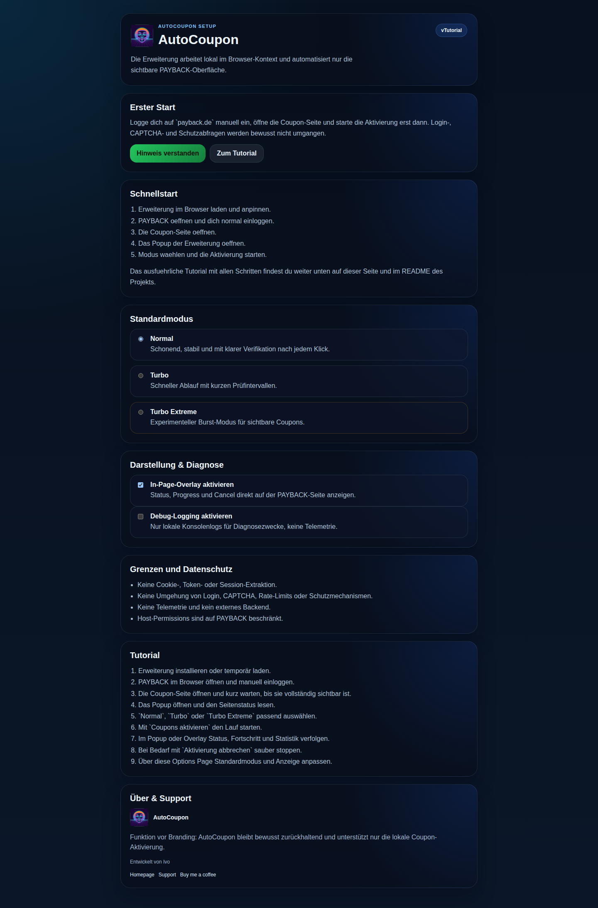

# AutoCoupon

AutoCoupon ist eine lokale Browser-Erweiterung fuer Chrome und Firefox, die sichtbare Coupons auf `payback.de` sequenziell aktiviert. Die Erweiterung arbeitet direkt im Browser-Kontext, nutzt kein externes Backend und umgeht weder Login noch CAPTCHA noch andere Schutzmechanismen.

## Projektbeschreibung

- basiert fachlich auf `AutoCoupon-Android`
- arbeitet lokal auf der sichtbaren PAYBACK-Seite
- keine Telemetrie, keine Cookie- oder Token-Extraktion
- Popup fuer Start, Stop, Status und Statistik
- Options Page fuer Einstellungen, Schnellstart und Tutorial
- optionales In-Page-Overlay fuer Laufstatus und Stop-Funktion

## Installation

### Chrome

1. `npm install`
2. `npm run build`
3. `chrome://extensions` oeffnen
4. Entwicklermodus aktivieren
5. `Entpackte Erweiterung laden` waehlen
6. `dist/chromium` auswaehlen

### Firefox

1. `npm install`
2. `npm run build`
3. `about:debugging#/runtime/this-firefox` oeffnen
4. `Temporäres Add-on laden...` waehlen
5. `dist/firefox/manifest.json` auswaehlen

## Kurzanleitung

1. Erweiterung im Browser laden und anpinnen.
2. `https://www.payback.de/coupons` oeffnen.
3. Dich normal bei PAYBACK einloggen.
4. Das AutoCoupon-Popup oeffnen.
5. Einen Modus waehlen.
6. `Coupons aktivieren` starten.
7. Statistik im Popup oder Overlay beobachten.
8. Bei Bedarf `Aktivierung abbrechen`.
9. Einstellungen ueber die Options Page anpassen.

## Schritt-fuer-Schritt-Tutorial

### 1. Erweiterung installieren

Die Erweiterung wird lokal geladen und danach am besten direkt an die Browser-Leiste angepinnt.



### 2. PAYBACK oeffnen und einloggen

Oeffne PAYBACK ganz normal im Browser und melde dich selbst an. AutoCoupon uebernimmt den Login nicht und greift nicht in Schutzabfragen ein.

### 3. Coupon-Seite oeffnen

Wechsle auf `https://www.payback.de/coupons` und warte kurz, bis die Seite sichtbar geladen ist.

### 4. Erweiterung oeffnen

Oeffne das Popup der Erweiterung. Dort siehst du sofort, ob die aktuelle Seite erkannt wurde und ob ein Start moeglich ist.


### 5. Aktivierungsmodus auswaehlen

Waehle den Modus, der am besten zu deiner Situation passt. Fuer die meisten Nutzer ist `Normal` die beste Wahl.



### 6. Coupons automatisch aktivieren

Mit `Coupons aktivieren` startet der Lauf. AutoCoupon verarbeitet nur sichtbare Coupons lokal im Browser und prueft jeden Schritt nach.



### 7. Ergebnis und Statistik verstehen

Nach dem Lauf siehst du, wie viele Coupons verarbeitet, aktiviert, uebersprungen oder nicht verfuegbar waren.



### 8. Aktivierung stoppen

Waehle `Aktivierung abbrechen`, wenn du den laufenden Durchgang sauber stoppen moechtest. Der Lauf endet dann kontrolliert als Abbruch und nicht als harter Fehler.

### 9. Einstellungen aendern

In der Options Page stellst du Standardmodus, Overlay und Debug-Logging ein. Dort findest du auch Schnellstart, Tutorial und Support-Links.



## Modi

### `normal`

- konservativ und am robustesten
- mit Klick-Verzoegerung und laengerer Verifikation
- beste Standardwahl

### `turbo`

- schneller als `normal`
- weiterhin mit kandidatenspezifischer Verifikation
- sinnvoll, wenn die Coupon-Seite stabil reagiert

### `turbo-extreme`

- schnellster Modus
- verarbeitet sichtbare Coupons in kleinen Bursts
- experimenteller als die anderen Modi

## Troubleshooting

### Popup zeigt `Login erforderlich`

- PAYBACK ist noch nicht eingeloggt
- oder eine Schutz-/Captcha-Seite ist aktiv
- Login bitte normal selbst abschliessen

### Popup zeigt `Nicht auf Coupon-Seite`

- oeffne `https://www.payback.de/coupons`
- warte kurz, bis die Seite vollstaendig sichtbar ist

### Popup zeigt `Layout derzeit nicht sicher lesbar`

- PAYBACK hat das Layout veraendert
- Seite neu laden und erneut pruefen
- wenn das Problem bleibt, Support kontaktieren

### Aktivierung laeuft nicht an

- pruefe, ob die Seite als `ready` erkannt wird
- pruefe, ob du dich bereits auf der Coupon-Seite befindest
- pruefe, ob ein anderer Lauf noch aktiv ist

### Overlay ist nicht sichtbar

- oeffne die Options Page
- aktiviere `In-Page-Overlay`
- lade die Coupon-Seite neu

## Branding, Support und Kontakt

- Entwickelt von Ivo
- Homepage: https://ivo-tech.com
- Support: https://ivo-tech.com/#contact
- Buy me a coffee: https://ko-fi.com/ivotech

Das Branding bleibt bewusst zurueckhaltend. Funktion, Statusanzeige und Bedienung haben immer Vorrang.

## Entwicklung und Checks

```bash
npm install
npm run lint
npm run typecheck
npm run test
npm run build
npm run check
```

Build-Ausgaben:

- `dist/chromium`
- `dist/firefox`

## Architektur in Kurzform

```text
src/
  background/         Broker zwischen Popup und Content
  content/            PAYBACK-DOM-Logik, Runner, Session, Overlay
  pages/              Popup, Options und gemeinsame UI-Teile
  platform/           Browser-, Messaging- und Storage-Adapter
  shared/             Contracts, Konfiguration und Logging
tests/
  unit/
  integration/
  fixtures/payback/
```

Wichtige Regeln:

- Popup spricht nie direkt mit dem Content Script
- PAYBACK-Selektoren und Pattern leben nur unter `src/content/sites/payback`
- Browser-Unterschiede leben nur unter `src/platform/browser`
- Persistenz erfolgt nur ueber `storage.local`

## Referenzen

- Android-Fachreferenz: [MainActivity.kt](/home/ivo/projects/AutoCoupon-Android/app/src/main/java/com/ivotech/autocoupon/MainActivity.kt)
- Android-Fachreferenz: [injector.js](/home/ivo/projects/AutoCoupon-Android/app/src/main/assets/injector.js)
- Root-Cause-Analyse: [docs/root-cause-analysis.md](docs/root-cause-analysis.md)

## Lizenz

MIT
